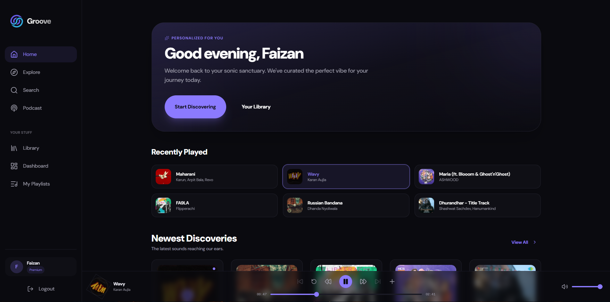
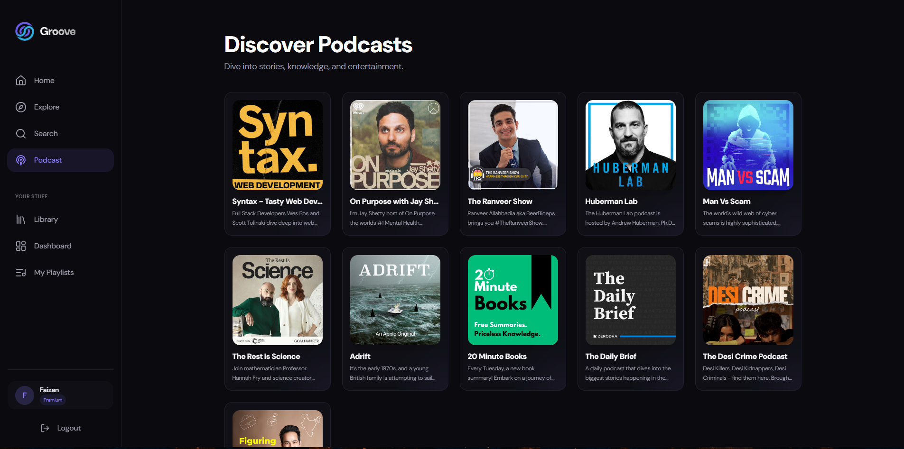
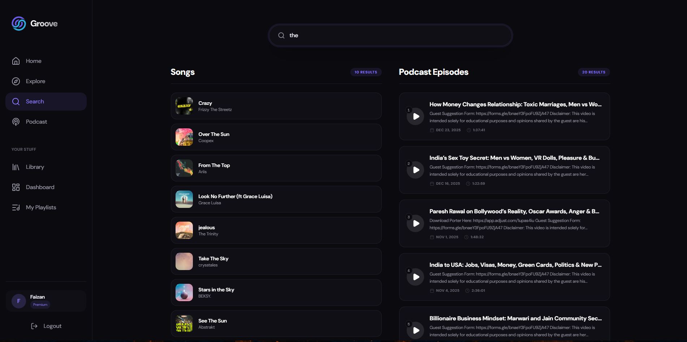

# Groove — Music Streaming Web App

Groove is a performance-optimized, full-stack music streaming platform designed to provide a seamless audio experience. It leverages a modern MERN-style architecture with Supabase for robust authentication, real-time database management, and distributed cloud storage.

## Project Overview

Groove is a production-grade music streaming application that demonstrates mastery of full-stack development, cloud integration, and complex frontend state management.

**Key Technical Achievements:**

- **Full-Stack Integration**: Orchestrated a decoupled architecture using React (Vite) and Node.js/Express, integrated with Supabase for centralized Auth and PostgreSQL management.
- **Dynamic Content Delivery**: Engineered an automated media pipeline where audio files are processed on the frontend to extract metadata (like duration) before being buffered to Supabase Storage.
- **Persistent State Management**: Implemented a globally accessible, interrupt-free audio MiniPlayer using React Context API and the HTML5 Audio API, ensuring continuous playback across route transitions.
- **Granular Security (RBAC)**: Developed a custom Role-Based Access Control system. Admin privileges are enforced via server-side middleware and identified through secure JWT claims in user metadata.
- **Cloud Media Orchestration**: Managed multi-bucket cloud storage environments for high-resolution cover art and optimized audio streams (MP3/WAV).

---

## Live Demo

The application is currently live at [Groove](https://groove-chi-virid.vercel.app/).

## Screenshots

Home Page


Admin Dashboard Control Center


Podcasts


Search Results


---

## Features

- **Personalized Libraries**: Users can create, update, and manage private playlists.
- **Intelligent Search**: Real-time querying across tracks and podcast collections.
- **Listening Insights**: Automated "Recently Played" tracking for a personalized homepage experience.
- **Admin Control Center**: A dedicated suite for managing the platform's content library, including category management and multi-media uploads.
- **Responsive Aesthetics**: A "Pitch Black" themed, high-performance UI built with Tailwind CSS and shadcn/ui components.

---

## Tech Stack

| Layer            | Technologies                                                       |
| :--------------- | :----------------------------------------------------------------- |
| **Frontend**     | React 19, Vite, React Router, Tailwind CSS, shadcn/ui, Lucide React, Context API |
| **Backend**      | Node.js, Express, Supabase Admin SDK, Multer                       |
| **Storage & DB** | Supabase Auth, PostgreSQL (PostgREST), Supabase S3 Storage         |
| **Audio**        | HTML5 Audio API, Custom useAudio Hooks                             |

---

## API Documentation

The backend exposes a RESTful API organized by feature modules. All private routes require a valid Supabase JWT.

### Auth & Admin

- **Admin Role Assignment**: Assigned via `backend/setAdmin.js` using the Supabase Service Key.

### Tracks & Podcasts (Public)

- `GET /api/tracks` — Retrieve all available music tracks.
- `GET /api/categories` — Retrieve all content categories.
- `GET /api/podcasts/collections` — List all podcast collections.
- `GET /api/podcasts/:collectionId` — Get details of a specific collection.
- `GET /api/podcasts/:collectionId/episodes` — List episodes within a collection.

### Playlists (Protected)

- `GET /api/playlists` — List all playlists owned by the authenticated user.
- `POST /api/playlists` — Create a new playlist.
- `PATCH /api/playlists/:id` — Update playlist title.
- `DELETE /api/playlists/:id` — Delete a playlist.
- `POST /api/playlists/:id` — Add a track to a playlist.
- `DELETE /api/playlists/:id/:trackId` — Remove a specific track.

### Admin Dashboard (Restricted)

_Requires metadata role: "admin"_

- `POST /api/admin/tracks` — Upload music with auto-duration detection.
- `POST /api/admin/podcasts` — Initialize a new podcast collection.
- `POST /api/admin/podcast-episodes` — Upload audio episodes to a collection.
- `DELETE /api/admin/categories/:id` — Remote content categories.

---

## Project Structure

```text
groove/
├─ backend/
│  ├─ controllers/     # Business logic for API endpoints
│  ├─ routes/          # API route definitions
│  ├─ middlewares/     # Auth (RBAC) and Upload handling
│  ├─ lib/             # Supabase client configurations
│  ├─ server.js        # Entry point
│  └─ setAdmin.js      # CLI utility for role management
├─ frontend/
│  ├─ src/
│  │  ├─ api/          # Axios instance & API services
│  │  ├─ components/   # UI components (Atomic design)
│  │  ├─ context/      # Global state (Auth/Audio)
│  │  ├─ hooks/        # Custom logic (Playlists/Recent)
│  │  ├─ pages/        # Route-level views
│  │  └─ layouts/      # Dashboard/Main layouts
└─ README.md
```

---

## Environment Variables

### Backend (`backend/.env`)

```env
PORT=5000
SUPABASE_URL=YOUR_SUPABASE_PROJECT_URL
SUPABASE_SERVICE_KEY=YOUR_SUPABASE_SERVICE_ROLE_KEY
```

### Frontend (`frontend/.env`)

```env
VITE_SUPABASE_URL=YOUR_SUPABASE_PROJECT_URL
VITE_SUPABASE_ANON_KEY=YOUR_SUPABASE_ANON_KEY
VITE_API_BASE_URL=http://localhost:5000/api
```

---

## Setup & Local Installation

### 1. Supabase Infrastructure

- Create a new project on [Supabase.com](https://supabase.com).
- Under **Storage**, create three **Public** buckets: `tracks`, `covers`, and `podcasts`.
- Enable Email/Password authentication.

### 2. Backend Installation

```bash
cd backend
npm install
# Configure .env with service_role key
npm run dev
```

### 3. Frontend Installation
> Note: Create a new terminal window for the frontend installation.
```bash
cd frontend
npm install
# Configure .env with anon key
npm run dev
```

### 4. Admin Setup

To access the Admin Control Center, create a user via the UI, then promote them:

```bash
cd backend
node setAdmin.js your-user-email@example.com
```

---

## Notes & Limitations

- **Admin Promotion**: Admin roles are managed strictly via the backend to prevent unauthorized escalation.
- **Media Buffering**: Large audio files are held in memory during the upload process before being streamed to Supabase.
